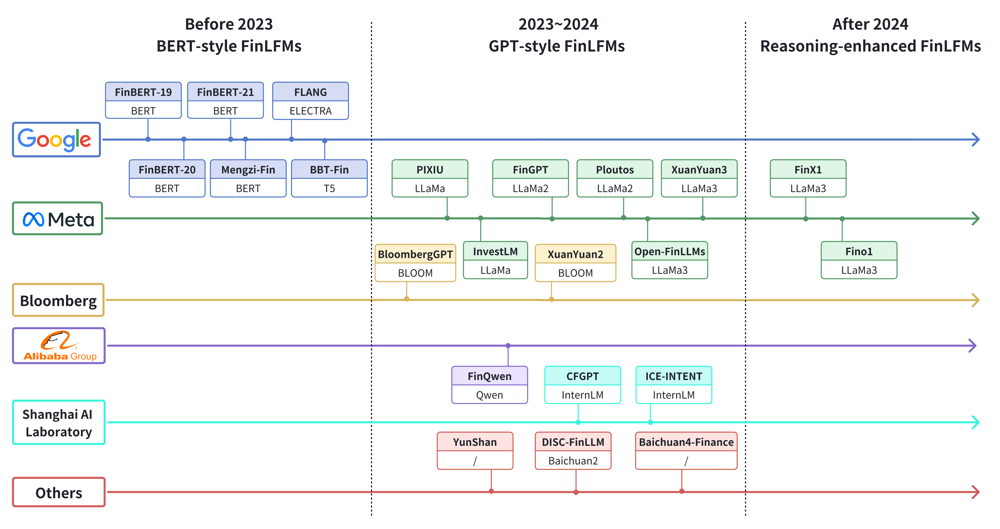

# Advancing Financial Engineering with Financial Foundation Models: Progress, Applications, and Challenges

<div align="center">
  
**A Survey on Financial Foundation Models**  

<div align="center">
  
</div>

</div>

## 📝 Introduction
This repository is the official companion to the survey paper **《Advancing Financial Engineering with Foundation Models: Progress, Applications, and Challenges》** published in the journal Engineering. The paper systematically reviews the progress, applications, and challenges of Financial Foundation Models (FFMs), covering key categories such as Financial Language Foundation Models (FinLFMs), Financial Time-Series Foundation Models (FinTSFMs), and Financial Visual-Language Foundation Models. It also collates a comprehensive collection of relevant datasets and real-world financial applications enabled by FFMs.

This repo serves as a centralized resource for researchers and practitioners in the field of financial artificial intelligence, providing curated references to seminal papers, open-source code, and benchmark datasets related to financial foundation models.

## 📖 Table of contents
- [Awesome Papers](#awesome-papers)
  - [Financial Foundation Models](#Financial-Foundation-Models)
    - [ Financial language foundation models](#Financial-Language-Foundation-Models)
      - [ BERT-style FinLFMs](#Bert-style-FinLFMs)
      - [ GPT-style FinLFMs](#GPT-style-FinLFMs)
      - [Reasoning-enhanced FinLFMs](#Reasoning-enhanced-FinLFMs)
    - [ Financial time-series foundation models](#Financial-Time-Series-Foundation-Models)
      - [Naive FinTSFMs trained from scratch](#Naive-FinTSFMs-Trained-from-Scratch)
      - [FinTSFMs adapted from language models](#FinTSFMs-Adapted-from-Language-Models)
    - [Financial visual-language foundation models](#Financial-Visual-Language-Foundation-Models)
  - [Financial Data](#Financial-Data)
    - [Financial text-based datasets](#Financial-text-based-Datasets)
      - [Task-specific and English-centric datasets](#Task-specific-and-English-centric)
      - [Multi-task integration and language expansion datasets](#Multi-task-Integration-and-Language-Expansion)
      - [Cross-lingual and real-world benchmarks](#Cross-lingual-and-Real-world-Benchmarks)
    - [Financial time-series-related datasets](#Financial-time-series-related-Datasets)
    - [Financial visual-language-related datasets](#Financial-Visual-Language-related-Datasets)
  - [ FFM-based financial applications](#FFM-based-Financial-Applications)
    - [Financial knowledge extraction](#Financial-Data-Structuring)
    - [Market prediction](#Market-Prediction)
    - [Trading and financial decision-making](#Trading-and-Financial-Decision)
    - [Agent-based financial simulation](#Multi-Agent-Systems)
- [Citation](#citiation)
- [Contribution](#contribution)


# Awesome Papers
## Financial Foundation Models
### Financial language foundation models
#### BERT-style FinLFMs
[1] [FinBERT: Financial Sentiment Analysis with Pretrained Language Models](https://arxiv.org/pdf/1908.10063) 

[2] [Finbert: A pretrained language model for financial communications.](https://arxiv.org/pdf/2006.08097) 

[3] [Finbert: A pre-trained financial language representation model for financial text mining](https://arxiv.org/pdf/2006.08097https://www.ijcai.org/proceedings/2020/0622.pdf) 

[4] [Mengzi: Towards Lightweight yet Ingenious Pre-trained Models for Chinese](https://arxiv.org/pdf/2110.06696) 

[5] [WHEN FLUE MEETS FLANG: Benchmarks and Large Pre-trained Language Model for Financial Domain](https://arxiv.org/pdf/2211.00083) 

[6] [BBT-Fin: Comprehensive Construction of Chinese Financial Domain Pre-trained Language Model, Corpus and Benchmark](https://arxiv.org/pdf/2302.09432) 


#### GPT-style FinLFMs
[1] [PIXIU: A Large Language Model, Instruction Data and Evaluation Benchmark for Finance](https://arxiv.org/pdf/2306.05443) [code](https://github.com/The-FinAI/PIXIU)

[2] [BloombergGPT:A Large Language Model for Finance](https://arxiv.org/pdf/2303.17564)  FinLLM workshop @ IJCAI2023

[3] [InvestLM: A Large Language Model for Investment using Financial Domain Instruction Tuning](https://arxiv.org/pdf/2309.13064) [code](https://github.com/AbaciNLP/InvestLM)

[4] [Xuanyuan 2.0: A large chinese financial chat model with hundreds of billions parameters](https://doi.org/10.1145/3583780.3615285) [code](https://github.com/Duxiaoman-DI/XuanYuan)

[5] [PanGu-𝜋:Enhancing Language Model Architectures via Nonlinearity Compensation](https://arxiv.org/pdf/2306.05443) 

[6] [Finqwen: Ai+finance](https://github.com/Tongyi-EconML/FinQwen).[code](https://github.com/Tongyi-EconML/FinQwen)

[7] [Fingpt: Open-source financial large language models](https://arxiv.org/pdf/2306.06031) [code](https://github.com/AI4Finance-Foundation/FinGPT)

[8] [Ploutos: Towards interpretable stock movement prediction with financial large language model](https://arxiv.org/pdf/2403.00782) 

[9] [Open-FinLLMs: Open Multimodal Large Language Models for Financial Applications](https://arxiv.org/pdf/2408.11878) [code](https://anonymous.4open.science/r/PIXIU2-0D70/B1D7/LICENSE)

[10] [Baichuan4-Finance Technical Report](https://arxiv.org/pdf/2412.15270) 

[11] [Disc-finllm: A chinese financial large language model based on multiple experts fine-tuning](https://arxiv.org/pdf/2310.15205) [code](https://github.com/FudanDISC/DISC-FinLLM)

[12] [Cfgpt: Chinese financial assistant with large language model](https://arxiv.org/pdf/2309.10654). [code](https://github.com/TongjiFinLab/CFGPT)

[13] [No Language is an Island: Unifying Chinese and English in Financial Large Language Models, Instruction Data, and Benchmarks](https://arxiv.org/pdf/2403.06249) [code](https://github.com/YY0649/ICE-PIXIU)


#### Reasoning-enhanced FinLFMs
[1] [Xuanyuan-finx1](https://github.com/Duxiaoman-DI/XuanYuan#XuanYuan-FinX1-Preview).[code](https://github.com/Duxiaoman-DI/XuanYuan)

[2] [Fino1: On the Transferability of Reasoning Enhanced LLMs to Finance](https://arxiv.org/pdf/2502.08127) [code](https://github.com/The-FinAI/Fino1)


### Financial time-series foundation models
#### Naive FinTSFMs trained from scratch
[1] [Marketgpt: Developing a pretrained transformer (gpt) for modeling financial time series](https://arxiv.org/pdf/2411.16585) [code](https://github.com/aaron-wheeler/MarketGPT)

[2] [A decoder-only foundation model for time-series forecasting](https://arxiv.org/abs/2310.10688) [code](https://huggingface.co/google/timesfm-1.0-200m)

[3] [Financial fine-tuning a large time series model](https://arxiv.org/pdf/2412.09880) [code](https://github.com/pfnet-research/timesfm_fin)

[4] [Dual adaptation of time-series foundation models for financial forecasting](https://openreview.net/attachment?id=SSdBpVNYxd&name=pdf) 

#### FinTSFMs adapted from language models
[1] [Time-llm: Time series forecasting by reprogramming large language models](https://arxiv.org/pdf/2310.01728) [code](https://github.com/KimMeen/Time-LLM)

[2] [Unitime: A language-empowered unified model for crossdomain time series forecasting](https://dl.acm.org/doi/pdf/10.1145/3589334.3645434) [code](https://github.com/liuxu77/UniTime)

[3] [Sociodojo: Building lifelong analytical agents with real-world text and time series](https://openreview.net/pdf?id=xuY33XhEGR) [code](https://github.com/chengjunyan1/SocioDojo)


### Financial visual-language foundation models
[1] [Finvis-gpt: A multimodal large language model for financial chart analysis](https://arxiv.org/pdf/2308.01430) [code](https://github.com/wwwadx/FinVis-GPT)

[2] [Fintral: A family of gpt-4 level multimodal financial large language models](https://arxiv.org/pdf/2402.10986) [code](https://github.com/UBC-NLP/fintral)

[3] [Open-FinLLMs: Open Multimodal Large Language Models for Financial Applications](https://arxiv.org/pdf/2408.11878) [code](https://www.thefin.ai/model/open-finllms)


## Financial Data
### Financial text-based datasets
#### Task-specific and English-centric datasets

[1] [Good debt or bad debt: Detecting semantic orientations in economic texts](https://www.semanticscholar.org/paper/Good-debt-or-bad-debt%3A-Detecting-semantic-in-texts-Malo-Sinha/4211bff1388da30a3b7dfd35d6aef2032900ca5c?p2df) [data](https://huggingface.co/datasets/takala/financial_phrasebank)

[2] [Domain adaption of named entity recognition to support credit risk assessment](https://aclanthology.org/U15-1010.pdf) [data](http://people.eng.unimelb.edu.au/tbaldwin/resources/finance-sec/)

[3] [Www’18 open challenge: Financial opinion mining and question answering](https://dl.acm.org/doi/pdf/10.1145/3184558.3192301) [data](https://sites.google.com/view/fiqa/home)

[4] [Stock movement prediction from tweets and historical price](http://anthology.aclweb.org/attachments/P/P18/P18-1183.Presentation.pdf) [data](https://github.com/yumoxu/stocknet-dataset)

[5] [Hybrid deep sequential modeling for social text-driven stock prediction](https://doi.org/10.1145/3269206.3269290) [data](https://github.com/wuhuizhe/CHRNN)

[6] [Impact of news on the commodity market: Dataset and results](https://link.springer.com/chapter/10.1007/978-3-030-73103-8_41) [data](https://www.kaggle.com/datasets/daittan/gold-commodity-news-and-dimensions)

[7] [Fintral: A family of gpt-4 level multimodal financial large language model](https://arxiv.org/pdf/2402.10986) [data](https://github.com/czyssrs/ConvFinQA)

#### Multi-task integration and language expansion datasets

[1] [WHEN FLUE MEETS FLANG: Benchmarks and Large Pre-trained Language Model for Financial Domain](https://arxiv.org/pdf/2211.00083) [data](https://github.com/SALT-NLP/FLANG)

[2] [PIXIU: A Large Language Model, Instruction Data and Evaluation Benchmark for Finance](https://arxiv.org/pdf/2306.05443) [data](https://github.com/The-FinAI/PIXIU)

[3] [FinEval: A Chinese Financial Domain Knowledge Evaluation Benchmark for Large Language Models](https://arxiv.org/pdf/2308.09975) [data](https://github.com/SUFE-AIFLM-Lab/FinEval)

[4] [CFBenchmark: Chinese financial assistant benchmark for large language model](https://arxiv.org/pdf/2311.05812) [data](https://github.com/TongjiFinLab/CFGPT/tree/main/benchmark)

[5] [Financeiq: Chinese financial domain knowledge assessment dataset](https://github.com/Duxiaoman-DI/XuanYuan/tree/main/FinanceIQ)[data](https://github.com/Duxiaoman-DI/XuanYuan)

[6] [CFinBench: A Comprehensive Chinese Financial Benchmark for Large Language Models](https://arxiv.org/pdf/2407.02301) [data](https://cfinbench.github.io/)

[7] [FLAME: Financial Large-Language Model Assessment and Metrics Evaluation](https://arxiv.org/pdf/2501.06211) [data](https://github.com/FLAME-ruc/FLAME)

#### Cross-lingual and real-world benchmarks

[1] [No Language is an Island: Unifying Chinese and English in Financial Large Language Models, Instruction Data, and Benchmarks](https://arxiv.org/pdf/2403.06249) [data](https://github.com/YY0649/ICE-PIXIU)

[2] [A dutch financial large language model](https://arxiv.org/pdf/2410.12835) [data](https://github.com/snoels/fingeit)

[3] [Benchmarking large language models on cflue - a chinese financial language understanding evaluation dataset](https://arxiv.org/pdf/2405.10542) [data](https://github.com/aliyun/cflue)

[4] [M³finmeeting: Multi-lingual multimodal benchmark for financial meeting understanding](https://arxiv.org/pdf/2406.07890) [data](https://github.com/aliyun/qwen-dianjin)

[5] [FinBen: a holistic financial benchmark for large language models](https://arxiv.org/pdf/2402.12659) [data](https://github.com/The-FinAI/PIXIU)

[6] [AlphaFin: Benchmarking Financial Analysis with Retrieval-Augmented Stock-Chain Framework](https://arxiv.org/pdf/2403.12582) [data](https://github.com/AlphaFin-proj/AlphaFin)

### Financial time-series-related datasets

[1] [Google stock prices – training and test data(2012–2017)](https://www.kaggle.com/datasets/vaibhavsxn/google-stock-prices-training-and-test-data)

[2] [S&P 500 historical data (1927–2020)](https://www.kaggle.com/datasets/henryhan117/sp-500-historical-data)

[3] [Modeling long and short-term temporal patterns with deep neural networks](https://arxiv.org/pdf/1703.07015) [data](https://github.com/laiguokun/multivariate-time-series-data)

[4] [Bitcoin daily price time series (2010–2020)](https://www.kaggle.com/datasets/soham1024/bitcoin-time-series-data-till-02082020)

[5] [Fnspid: A comprehensive financial news dataset in time series](https://arxiv.org/pdf/2402.06698) [data](https://huggingface.co/datasets/Zihan1004/FNSPID)

[6] [Fintsb: A comprehensive and practical benchmark for financial time series forecasting](https://arxiv.org/pdf/2502.18834) [data](https://github.com/TongjiFinLab/FinTSBenchmark)

### Financial visual-language-related datasets

[1] [Statlog (australian credit approval)]( https://doi.org/10.24432/C59012)[data](https://archive.ics.uci.edu/dataset/143/statlog+australian+credit+approval)

[2] [Statlog (German Credit Data) ](https://doi.org/10.24432/C5NC77)[data](https://archive.ics.uci.edu/dataset/144/statlog+german+credit+data)

[3] [Tat-qa: A question answering benchmark on a hybrid of tabular and textual content in finance](https://arxiv.org/pdf/2105.07624) [data](https://nextplusplus.github.io/TAT-QA/)

[4] [Finqa: A dataset of numerical reasoning over financial data](https://arxiv.org/pdf/2109.00122) [data](https://github.com/czyssrs/FinQA)

[5] [Chartqa:A benchmark for question answering about charts with visual and logical reasoning](https://arxiv.org/pdf/2203.10244) [data](https://github.com/vis-nlp/ChartQA)

[6] [Convfinqa: Exploring the chain of numerical reasoning in conversational finance question answering](https://arxiv.org/pdf/2210.03849) [data](https://github.com/czyssrs/ConvFinQA)

[7] [Mmmu: A massive multi-discipline multimodal understanding and reasoning benchmark for expert AGI](https://arxiv.org/pdf/2311.16502) [data](https://mmmu-benchmark.github.io/)

[8] [Fintral: A family of gpt-4 level multimodal financial large language models](https://arxiv.org/pdf/2402.10986) [data](https://github.com/UBC-NLP/fintral)

[9] [Open-FinLLMs: Open Multimodal Large Language Models for Financial Applications](https://arxiv.org/pdf/2408.11878) [data](https://chartbench.github.io/)

[10] [Mme-finance: A multimodal finance benchmark for expert-level understanding and reasoning](https://arxiv.org/pdf/2411.03314) [data](https://hithink-research.github.io/MME-Finance/)

[11] [Fcmr: Robust evaluation of financial cross-modal multi-hop reasoning](https://arxiv.org/pdf/2412.12567v4)

[12] [Famma: A benchmark for financial domain multilingual multimodal question answering](https://arxiv.org/pdf/2410.04526) [data](https://famma-bench.github.io/famma/)

[13] [Finmme: Benchmark dataset for financial multi-modal reasoning evaluation](https://arxiv.org/pdf/2505.24714) [data](https://huggingface.co/datasets/luojunyu/FinMME)

## FFM-based financial applications
### Financial knowledge extraction

[1] [No Language is an Island: Unifying Chinese and English in Financial Large Language Models, Instruction Data, and Benchmarks](https://arxiv.org/pdf/2403.06249)

[2] [Large language models as financial data annotators: A study on effectiveness and efficiency](https://arxiv.org/pdf/2403.18152)

[3] [Assessing large language models used for extracting table information from annual financial reports](https://www.mdpi.com/2073-431X/13/10/257)

### Market prediction

[1] [Time-series foundation model for value-at-risk](https://arxiv.org/pdf/2410.11773)

[2] [Can large language models beat wall street? evaluating gpt-4’s impact on financial decision-making with marketsenseai](https://link.springer.com/article/10.1007/s00521-024-10613-4) 

[3] [Enhancing stock timing predictions based on multimodal architecture: Leveraging large language models (llms) for text quality improvement](https://journals.plos.org/plosone/article?id=10.1371/journal.pone.0326034) 

[4] [Can chatgpt improve investment decisions? from a portfolio management perspective](https://papers.ssrn.com/sol3/papers.cfm?abstract_id=4390529)

### Trading and financial decision-making

[1] [Ra-cfgpt: Chinese financial assistant with retrieval-augmented large language model](https://journal.hep.com.cn/fcs/EN/10.1007/s11704-024-31018-5) 

[2] [Finmem: A performance-enhanced llm trading agent with layered memory and character design](https://arxiv.org/pdf/2311.13743)

[3] [Llmfactor: Extracting profitable factors through prompts for explainable stock movement prediction](https://arxiv.org/pdf/2401.10020)

[4] [Can chatgpt improve investment decisions? from a portfolio management perspective](https://papers.ssrn.com/sol3/papers.cfm?abstract_id=4390529)

### Agent-based financial simulation

[1] [Tradingagents: Multi-agents llm financial trading framework](https://arxiv.org/pdf/2412.20138)

[2] [Can large language models trade? testing financial theories with llm agents in market simulations](https://arxiv.org/pdf/2504.10789)

[3] [When ai meets finance (stockagent): Large language model-based stock trading in simulated real-world environments](https://arxiv.org/pdf/2407.18957)

[4] [FinRpt: Dataset, Evaluation System and LLM-based Multi-agent Framework for Equity Research Report Generation](https://arxiv.org/abs/2511.07322) [code](https://github.com/jinsong8/FinRpt) [data](https://huggingface.co/datasets/jinsong8/FinRpt)


# Citiation
If you find this survey or the curated resources helpful for your research, please cite the paper as follows:

```
@article{chen2025advancing,
    title = {Advancing Financial Engineering with Foundation Models: Progress, Applications, and Challenges},
    author = {Chen, Liyuan and Liu, Shuoling and Yan, Jiangpeng and Wang, Xiaoyu and Liu, Henglin and Li, Chuang and Jiao, Kecheng and Ying, Jixuan and Liu, Yang Veronica and Yang, Qiang and Li, Xiu},
    journal = {Engineering},
    year = {2025},
    doi = {10.1016/j.eng.2025.11.029},
    url = {https://doi.org/10.1016/j.eng.2025.11.029}
}
```

# Contribution
We welcome the community to contribute to this repository! If you would like to recommend new papers (including your own work) to be added to the list, please **submit an issue** in this repository with the following information:

- Paper title and arXiv/DOI URL
- Code repository link (if available)
- Brief classification (e.g., GPT-style FinLFM, Financial time-series dataset, Market Prediction application)

We will review and update the list regularly to keep it comprehensive and up-to-date.
